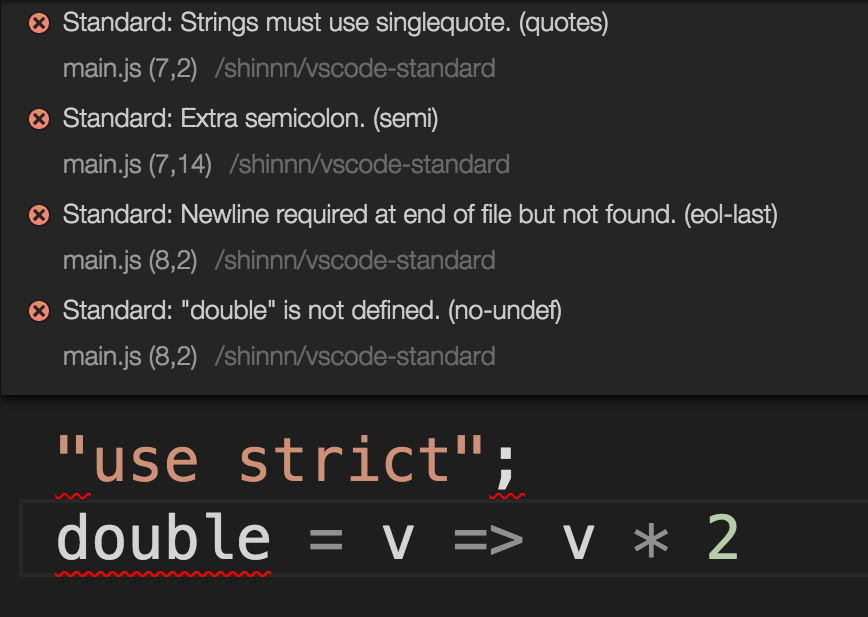

# vscode-standard

[](https://david-dm.org/shinnn/vscode-standard)
[](https://david-dm.org/shinnn/vscode-standard#info=devDependencies)

A [Visual Studio Code](https://code.visualstudio.com/) extension to lint JavaScript with [Standard Style](https://github.com/feross/standard):

> One Style to Rule Them All



## Installation

1. Run [`Install Extension`](https://code.visualstudio.com/docs/editor/extension-gallery#_install-an-extension) command from [Command Palette](https://code.visualstudio.com/Docs/editor/codebasics#_command-palette).
2. Search and choose `standard`.

See the [extension installation guide](https://code.visualstudio.com/docs/editor/extension-gallery) for details.

## Usage

Enable the linter in the VS Code [settings](https://code.visualstudio.com/docs/customization/userandworkspace).

```json
{
  "standard.enable": true
}
```

## License

Copyright (c) 2015 [Shinnosuke Watanabe](https://github.com/shinnn)

Licensed under [the MIT License](./LICENSE).
